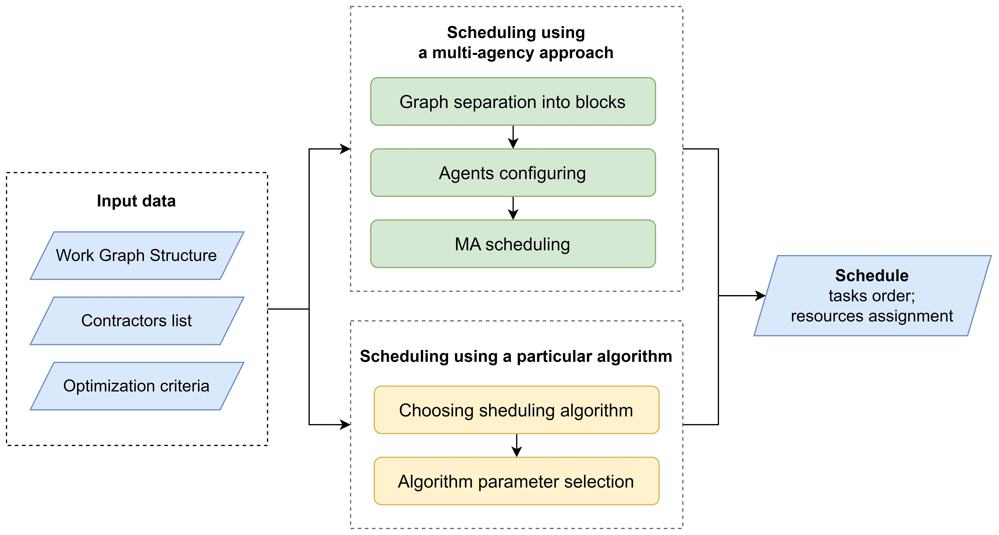

   
Scheduler for Adaptive Manufacturing Processes Optimization
======================

.. start-badges
.. list-table::
   :stub-columns: 1

   * - affiliation
     - | |sai| |itmo|
   * - package
     - | |pypi| |py_10|
   * - license
     - | |license|
   * - support
     - | |mailto|
   * - mirror
     - | |mirror| 

.. end-badges

**SAMPO** is an open-source framework for adaptive manufacturing processes scheduling. This framework is distributed under the 3-Clause BSD license.

It provides toolbox for generating schedules of manufacturing process under the constraints imposed by the subject area. The core of SAMPO is based on the combination of meta-heuristic, genetic and multi-agent algorithms. Taking as input the task graph with tasks connections and resource constraints, as well as the optimization metric, the scheduler builds the optimal tasks sequence and resources assignment according to the given metric.

Installation
============

SAMPO package is available via PyPI:

.. code-block::

  $ pip install sampo

SAMPO Features
============

The following algorithms for projects sheduling are implemented:

* Topological - heuristic algorithm based in toposort of WorkGraph
* HEFT (heterogeneous earliest finish time) and HEFTBetween - heuristic algorithms based on critical path heuristic
* Genetic - algorithm that uses heuristic algorithms for beginning population and modelling evolution process

Difference from existing implementations:

* Module for generating graphs of production tasks with a given structure
* Easy to use pipeline structure
* Multi-agent modeling block, allowing you to effectively select a combination of planning algorithms for a particular project
* Ability to handle complex projects with a large number of works (2-10 thousand)

How to Use
==========

To use the API, follow these steps:

1. Input data preparation

To use SAMPO for the schedule generation you need to prepare:

* WorkGraph object with the works information representation, including volumes of the works and connections between them
* list of Contractor objects with the information about available resources types and volumes.

    1.1. Loading WorkGraph from file

    .. code-block:: python

      wg = WorkGraph.load(...)

    1.2. Generating synthetic WorkGraph

    .. code-block:: python

      from sampo.generator import SimpleSynthetic

      # SimpleSynthetic object used for the simple work graph structure generation
      ss = SimpleSynthetic()

      # simple graph
      # should generate general (average) type of graph with 10 clusters from 100 to 200 vertices each
      wg = ss.work_graph(mode=SyntheticGraphType.General,
                         cluster_counts=10,
                         bottom_border=100,
                         top_border=200)

      # complex graph
      # should generate general (average) type of graph with 300 unique works, 100 resources and 2000 vertices
      wg = ss.advanced_work_graph(works_count_top_border=2000,
                                  uniq_works=300,
                                  uniq_resources=100)

    1.3. Contractors generation

    Manual Contractor list generation:

    .. code-block:: python

    contractors = [Contractor(id="OOO Berezka", workers=[Worker(id='0', kind='general', count=100)])]

2. Scheduling process

    2.1. Scheduler constructing

    There are 4 classes of schedulers available in SAMPO:

    - HEFTScheduler
    - HEFTBetweenScheduler
    - TopologicalScheduler
    - GeneticScheduler

    Each of them has various hyper-parameters to fit. They should be passed when scheduler object created.

    .. code-block:: python

      from sampo.scheduler.heft import HEFTScheduler

      scheduler = HEFTScheduler()

    .. code-block:: python

      from sampo.scheduler.genetic import GeneticScheduler

      scheduler = GeneticScheduler(mutate_order=0.1,
                                   mutate_resources=0.3)

    2.2. Schedule generation

    .. code-block:: python

      schedule = scheduler.schedule(wg, contractors)

3. Pipeline structure

When data was prepared and scheduler built, you should use scheduling pipeline to control the scheduling process:

.. code-block:: python

  from sampo.pipeline import SchedulingPipeline

  schedule = SchedulingPipeline.create() \
        .wg(wg) \
        .contractors(contractors) \
        .schedule(HEFTScheduler()) \
        .finish()

Supported by
============

The study is supported by the `Research Center Strong Artificial Intelligence in Industry <https://sai.itmo.ru/>`_ 
of `ITMO University <https://en.itmo.ru/>`_ as part of the plan of the center's program: Development and testing of an experimental prototype 
of a library of strong AI algorithms in terms of adaptive optimization of production processes based on intelligent technologies, 
multi-criteria evolutionary schemes and a multi-agent simulation environment.

.. |itmo| image:: https://github.com/ITMO-NSS-team/open-source-ops/blob/master/badges/ITMO_badge_flat.svg
   :alt: ITMO site
   :target: https://en.itmo.ru/en/

.. |sai| image:: https://github.com/ITMO-NSS-team/open-source-ops/blob/master/badges/SAI_badge_flat.svg
   :alt: SAI site
   :target: https://sai.itmo.ru/

.. |pypi| image:: https://badge.fury.io/py/sampo.svg
   :alt: Supported Python Versions
   :target: https://badge.fury.io/py/sampo

.. |py_10| image:: https://img.shields.io/badge/python_3.10-passing-success
   :alt: Supported Python Versions
   :target: https://img.shields.io/badge/python_3.10-passing-success

.. |license| image:: https://img.shields.io/github/license/Industrial-AI-Research-Lab/sampo
   :alt: Supported Python Versions
   :target: https://github.com/Industrial-AI-Research-Lab/sampo/blob/master/LICENSE

.. |mailto| image:: https://img.shields.io/badge/email-IAIRLab-blueviolet
   :alt: Framework Support
   :target: mailto:iairlab@yandex.ru

.. |mirror| image:: https://camo.githubusercontent.com/9bd7b8c5b418f1364e72110a83629772729b29e8f3393b6c86bff237a6b784f6/68747470733a2f2f62616467656e2e6e65742f62616467652f6769746c61622f6d6972726f722f6f72616e67653f69636f6e3d6769746c6162
   :alt: Gitlab Mirror
   :target: https://gitlab.actcognitive.org/itmo-sai-code/sampo
